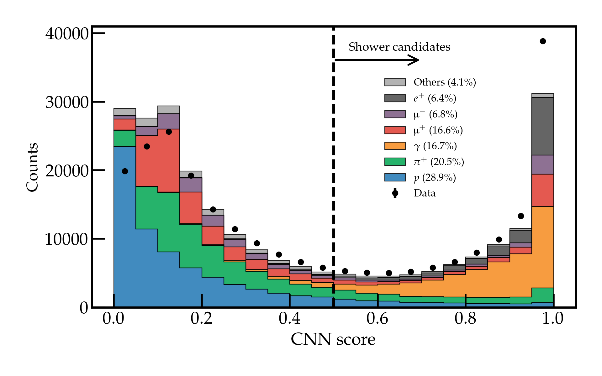
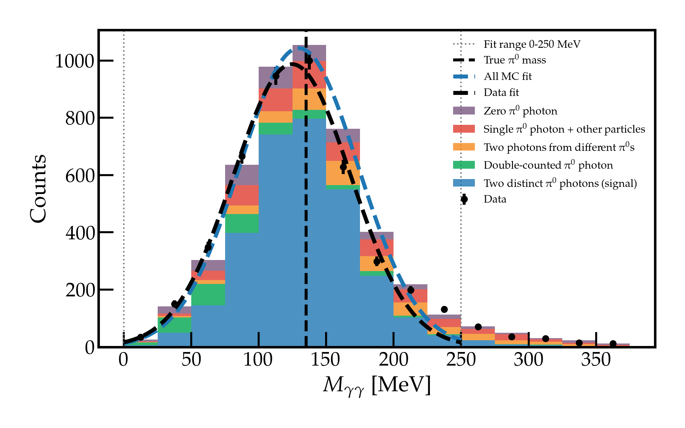

# ProtoDUNE Analysis

ProtoDUNE-SP is an 800-tonne liquid argon detector at CERN, built as a full-scale prototype for the DUNE experiment. It images particle interactions in 3D by recording the trails of charge and light left behind as particles traverse the liquid argon. Example 2D projection of a particle interactino in ProtoDUNE-SP:

Raw detector signals are processed by Pandora, a multi-algorithm 3D reconstruction framework that identifies individual particle trajectories from wire readout data. Each reconstructed object is then scored by a convolutional neural network (CNN) trained to distinguish shower-like signatures from track-like ones, giving a probability score used in downstream analysis to select signal candidates.

This repository contains analysis code built on top of these reconstructed objects, for two studies using 1 GeV pion beam data:

**1. Neutral pion reconstruction**

Neutral pions decay almost instantly into two photons. Identifying this decay in 3D liquid argon detector images requires distinguishing photon-like showers from track-like particles, then selecting pairs whose directions converge to a common decay vertex. Reconstructing photon pair signatures from neutral pion decays is necessary to calibrate shower reconstruction and validate detector energy response.

Code: [pi0_analysis_full.ipynb](pi0_analysis_full.ipynb)

The CNN shower score distribution below shows how the reconstruction software separates photons and electrons (shower-like, score → 1) from muons, pions, and protons (track-like, score → 0), motivating the selection threshold used in the analysis.

After applying geometric and kinematic selection cuts, the two-photon invariant mass peaks near the known π⁰ mass of 135 MeV in both data and simulation, validating the shower energy reconstruction and the analysis pipeline.

**2. Pion production cross-section**
First measurement of the pion production channel in liquid argon, a key systematic input for neutrino energy reconstruction in DUNE.
TBD

## Tools
Python · NumPy · SciPy · Matplotlib · Shapely
